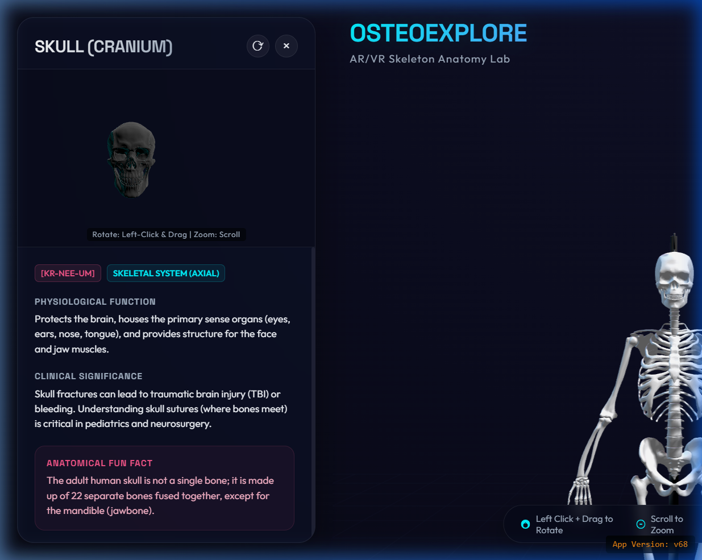
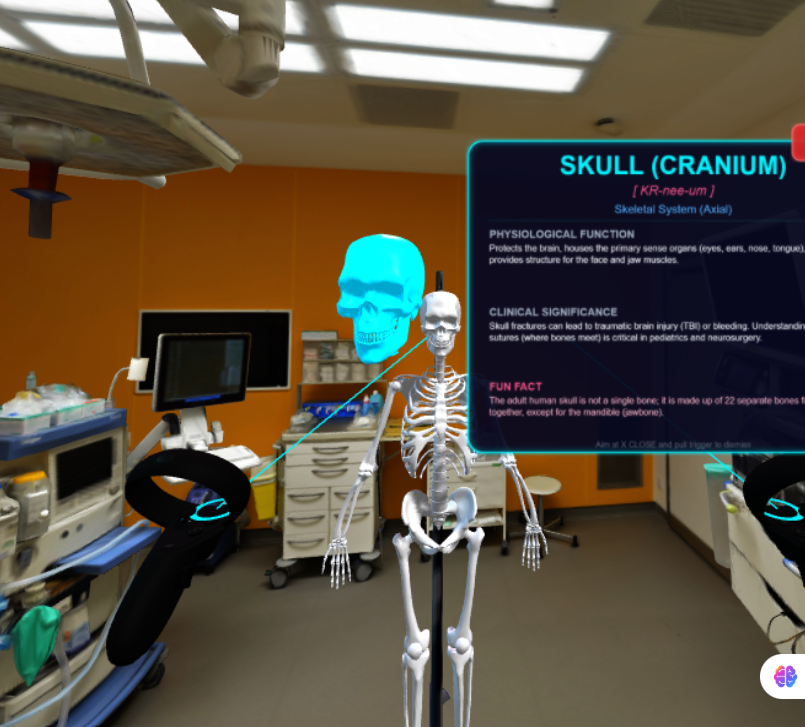
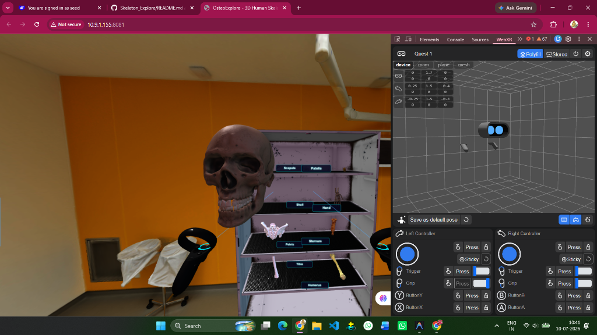
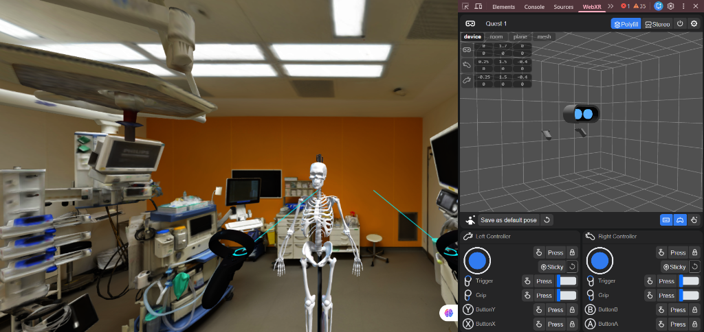
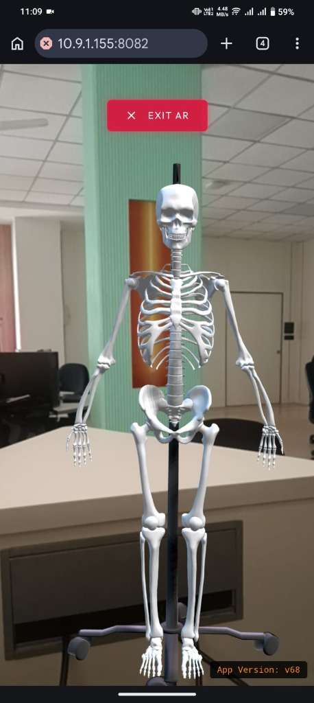

# OsteoExplore - 3D Human Skeleton AR & VR Explorer

OsteoExplore is an immersive, high-fidelity WebGL application designed to explore human osteology and skeletal anatomy in interactive 3D, Virtual Reality (VR), and Augmented Reality (AR). Using Three.js, the WebXR Device API, and detailed 3D models, it transforms anatomy learning into an engaging spatial experience.

Set inside a meticulously detailed virtual operating room, users can study a life-size human skeleton, inspect individual bone models stored in an interactive lab cabinet, or enter VR to grab, scale, and inspect bone structures up close.

---

## 📸 Application Screenshots

### Desktop Viewport

*Figure 1: The desktop viewport showing the main skeleton, interactive 3D hotspots, and the detailed glassmorphic Dossier Panel with an isolated, rotatable view of the skull.*

### WebXR Virtual Reality (VR) Mode

*Figure 2: Inside VR mode using a WebXR headset. The selected bone (Skull) is highlighted with a glowing overlay, alongside a floating holographic information panel and an isolated 3D preview model.*


*Figure 3: Interacting with the laboratory cabinet in VR. The user has grabbed the skull model from the shelf using controller grip triggers to zoom, rotate, and inspect it.*

### WebXR Augmented Reality (AR) Mode

*Figure 4: Simulated Augmented Reality (AR) pass-through mode in the WebXR Device API emulator, displaying the life-size skeleton model aligned with controller guides.*


*Figure 5: Live mobile webcam pass-through AR mode running on a physical smartphone, placing the interactive 3D skeleton model in the real-world room.*

---

## 🌟 Key Features

*   **Interactive 3D Viewport**: Smooth controls to rotate, zoom, and pan around a medical-grade 3D human skeleton standing on an IV pole in a virtual operating room.
*   **Aesthetic UI (Dossier Panel)**: A futuristic glassmorphic sidebar featuring:
    *   An **Isolated 3D View** allowing independent orbital control, rotation, and inspection of the selected bone.
    *   Comprehensive anatomical data: pronunciation guides, classification (Axial vs. Appendicular), physiological function, clinical significance, and fun facts.
*   **Virtual Reality (VR) Classroom**:
    *   Compatible with WebXR headsets (e.g., Meta Quest series, Zapbox, or simulated WebXR environments).
    *   **VR Locomotion**: Teleportation and smooth movement using thumbsticks/joysticks.
    *   **Holographic Info Panel**: A floating VR screen rendering real-time descriptions and details for selected bones.
    *   **Floating 3D Previews**: Selected bones materialize adjacent to the holographic panel in the VR world.
    *   **Interactive Grabbing**: Walk over to the lab cabinet, squeeze your controller trigger/grip, and pick up individual bone models (e.g., Skull, Pelvis, Sternum).
    *   **Manipulate Bones**: Rotate grabbed bones or adjust their distance and scale dynamically using controller thumbsticks.
*   **Augmented Reality (AR) Sandbox**: Mobile AR camera pass-through support with device orientation controls.
*   **Interactive Lab Cabinet**: An auxiliary cabinet with dedicated shelves displaying individual bone models with custom billboarded 3D text tags.
*   **WebGL Fallback Guidance**: Built-in visual alerts and instructions for enabling hardware acceleration in browsers if WebGL fails to initialize.

---

## 🛠️ Tech Stack, Libraries & Dependencies

### Core Technologies
*   **HTML5 & CSS3**: Structured layout and premium styling utilizing custom CSS variables, glassmorphism UI principles, and responsive keyframe animations.
*   **Vanilla JavaScript (ES6+)**: Core logic handled via standard JavaScript modules (Import/Export).

### Runtime Dependencies (External CDNs)
To maintain a fast, build-step-free static architecture, external libraries are loaded dynamically using import maps and CDNs:
*   **[Three.js (v150)](https://threejs.org/)**: The core WebGL engine for 3D graphic rendering.
*   **Three.js Addons**:
    *   `OrbitControls`: Enables smooth orbital camera navigation (pan/zoom/rotate) on desktop and mobile.
    *   `GLTFLoader`: Imports external GLTF/GLB models for the skeleton and environment.
*   **[WebXR Polyfill](https://github.com/immersive-web/webxr-polyfill)**: Loaded from `jsDelivr` to guarantee fallback device-orientation controls and Cardboard support on devices without native WebXR.
*   **[ES Module Shims](https://github.com/guybedford/es-module-shims)**: Polyfills import maps support for older web browsers.

### Development Dependencies
*   **Node.js http-server**: A simple command-line HTTP server wrapper used specifically to serve the project over HTTPS locally, satisfying WebXR security requirements.

---

## 📂 Project Directory Structure

```text
Human_skeleton_Explore/
│
├── assets/
│   ├── dossier_panel_skull.png     # Screenshot showing the application HUD & Skull Dossier
│   ├── webcam_ar_mode.jpg          # Live mobile webcam pass-through AR screenshot
│   ├── webxr_ar_mode.png           # Screenshot showing simulated AR pass-through mode
│   ├── webxr_vr_cabinet.png        # Screenshot showing VR cabinet bone interaction
│   └── webxr_vr_dossier.png        # Screenshot showing VR holographic dossier panel
│
├── skeleton/                       # GLTF/GLB 3D models directory
│   ├── Room_updated.glb            # Visual medical operating room scene
│   ├── IVPole.glb                  # IV stand for the main skeleton
│   ├── human_skeleton.glb          # Core 3D human skeleton model
│   ├── lab_shelf.glb               # Medical bone cabinet model
│   ├── skull_downloadable.glb      # High-quality skull bone model
│   ├── human_pelvis.glb            # Pelvis bone model
│   ├── human_sternum.glb           # Sternum bone model
│   ├── human_humerous.glb          # Humerus bone model
│   ├── human_tibia.glb             # Tibia bone model
│   ├── human_patella.glb           # Patella bone model
│   ├── human_hand_bones.glb        # Hand bone model
│   └── human_scapula.glb           # Scapula bone model
│
├── index.html                      # HTML5 page skeleton and import maps config
├── style.css                       # Stylesheet containing the custom design system
├── main.js                         # Core application script (Init, WebGL, XR, & Interaction loops)
├── data.js                         # Database containing bone metadata, bounds, and pin coordinates
├── cert.pem                        # SSL Certificate for HTTPS local hosting
└── key.pem                         # Private SSL Key for HTTPS local hosting
```

---

## 🎮 How to Interact

### Desktop & Mobile
*   **Rotate Scene**: Left-click and drag (desktop) or touch and drag (mobile).
*   **Zoom**: Mouse scroll wheel (desktop) or pinch-to-zoom (mobile).
*   **Inspect Bone**: Left-click directly on any labeled 3D hotspot pin or click the bone geometry itself. This launches the **Dossier Panel** on the left.
*   **Dossier View**: Scroll to read clinical facts, and drag within the dossier viewport canvas to rotate the isolated model.

### Virtual Reality (VR)
*   **Movement**: Use the thumbstick on either VR controller to walk or turn within the room.
*   **Selecting Bones**: Aim your controller pointer at the skeleton pins or buttons and pull the **Trigger** to display details on the holographic HUD.
*   **Cabinet Bone Interaction**:
    1. Walk to the wooden lab cabinet on the side of the room.
    2. Point at a bone model on the shelves.
    3. Press and hold the **Squeeze/Grip** button to grab and pick up the bone.
    4. Move the controller to bring the bone closer or rotate it.
    5. While holding a bone, use the **Thumbstick** to rotate (Left/Right) or scale/zoom (Up/Down) the model.
    6. Release the **Squeeze/Grip** button to return the bone back to its shelf.

---

## 🚀 Local Development Setup

To run this project on your local machine, follow the steps below.

### 📋 Prerequisites

Before you start, make sure you have the following installed on your machine:
1. **Git**: To clone the repository. [Download Git](https://git-scm.com/).
2. **Node.js & npm** (v14 or higher recommended): To run the local development server. [Download Node.js](https://nodejs.org/).

---

### 💻 Step-by-Step Instructions

#### 1. Clone the Repository
Clone the project repository using Git:
```bash
git clone <repository-url>
```
*(Replace `<repository-url>` with the actual repository URL)*

#### 2. Navigate to the Project Directory
Change directory to the cloned repository:
```bash
cd Human_skeleton_Explore
```

#### 3. Start the Secure Local Server
To test WebXR features (AR & VR), browsers enforce a strict security policy requiring a secure connection (**HTTPS**) or `localhost`. This repository comes pre-packaged with local SSL certificates (`cert.pem` and `key.pem`) to make HTTPS setup automatic.

Run the secure server in the repository root directory using `npx` (which downloads and runs `http-server` without needing a manual global package install):
```bash
npx http-server -S -C cert.pem -K key.pem -p 8081
```
*   `-S`: Enables SSL/TLS (HTTPS).
*   `-C cert.pem` and `-K key.pem`: References the bundled local certificates.
*   `-p 8081`: Binds the server to port `8081`.

#### 4. Open in Your Browser
Once the server starts up, open your web browser and navigate to:
```text
https://localhost:8081
```

> [!IMPORTANT]
> **SSL Certificate Warning:** Since the bundled SSL certificates are self-signed for local development, your browser will display a warning like `"Your connection is not private"` or `"Potential Security Risk Ahead"`.
> - **To proceed**: Click **Advanced** and then click **Proceed to localhost (unsafe)** or **Accept the Risk and Continue**.

---

### 🥽 Testing on a VR Headset (e.g., Meta Quest)

To test the VR mode on an actual headset:
1. Make sure your computer and VR headset are connected to the **same Wi-Fi network**.
2. Note your computer's local IP address (e.g., `192.168.1.100`).
3. Open the Meta Quest browser (or equivalent) and navigate to your computer's IP:
   ```text
   https://<your-computer-ip>:8081
   ```
4. Accept the self-signed certificate warning as described in Step 4.

---

### 🖥️ Testing in a Desktop Browser (Without a VR Headset)

If you do not have a physical VR headset, you can simulate and test AR/VR inputs directly in your desktop browser:
1. Install the **WebXR API Emulator** extension for your browser:
   * [Chrome Web Store](https://chromewebstore.google.com/detail/webxr-api-emulator/mjddjgeghidkamebkajehcekiejabkiq)
   * [Firefox Add-ons](https://addons.mozilla.org/en-US/firefox/addon/webxr-api-emulator/)
2. Open the application in your browser (`https://localhost:8081`).
3. Open your browser's Developer Tools (Press `F12` or `Ctrl+Shift+I`).
4. Select the **WebXR** tab in the DevTools panel.
5. Choose a simulated device (e.g., Meta Quest 2).
6. Click the **VR Experience** button in the app. The emulator will simulate headset movements and controllers, allowing you to test interactions without physical hardware.

---

### 🌐 Production Deployment

Since OsteoExplore is a pure static web application, it can be deployed to any static hosting provider. The only requirement is that the hosting provider **must support HTTPS** (as WebXR APIs are blocked on unsecured HTTP connections):
*   **GitHub Pages**: Push the repository to GitHub, go to repository Settings -> Pages, and enable deployment from the `main` branch. GitHub Pages handles SSL/HTTPS automatically.
*   **Vercel / Netlify**: Connect the repository to Vercel or Netlify. They will automatically detect the static project and serve it over a secure SSL certificate.
